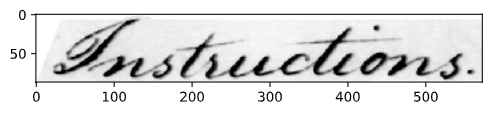
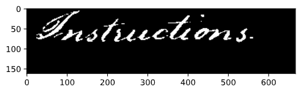
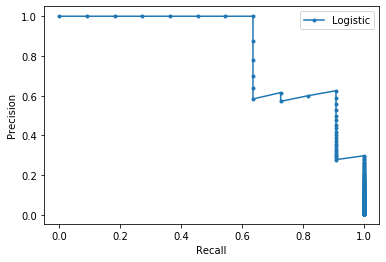
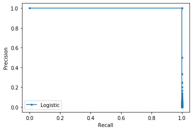
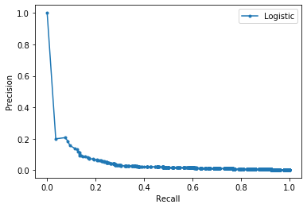

# 3_Keyword_Spotting

Pattern Recognition Task 3

## Results

### Result of preprocessing

The preprocessing go through the data doing these 3 steps:

1. Masking  
    Each word is isolated following the mask given in the dataset.  
    
2. Binarising  
   To binarised the data, we're using a filter with [Otsu's Method](https://en.wikipedia.org/wiki/Otsu%27s_method) to only grab the writing above a threshold from the picture directly.  
   
3. Normalising  
    For this step, we have combined all the data across the whole dataset to extend all picture to the biggest height and width.  
    

As the data doesn't change, we save the binarised data in a pickled file (the masking being the slowest of the 3 steps at 1m30s per page) located [here](Code/pkl).

### Features

The cropped images were loaded and each column of the images are referred to as feature vectors. Each image was passed to the different functions to extract their features. Each column of the image is analyzed to get the intended features and then appended to a matrix. Each line of the matrix is an array of features that correspond to each column in the image. Then the image and it's complete matrix are stored in a dictionairy.  
Features that are found:

1. Lower contour
2. Upper contour
3. Transition from black to white pixels
4. Fraction of black pixels
5. Fraction of black pixels between the upper and lower contour
6. Gradient from one feature vector's upper and lower contour to the next

### DTW algorithm and evaluation

For the DTW algorithm, the implementation used is the one proposed [by the library tslearn](https://tslearn.readthedocs.io/en/stable/gen_modules/metrics/tslearn.metrics.dtw.html#tslearn.metrics.dtw).

After sorting the results and filtering the words to only those that appears both in training and validation set, the precision and recall was computed for each threshold k.

Here are some examples of good results :

* AP = 0.826, word : Instructions

 
  
* AP = 1.0, word : John

 

However the majority of words resulted in less good results, maybe because of their number of occurences or difference in each page, therefore the final curve of precision and recall is the following, with an AP=0.059 :

