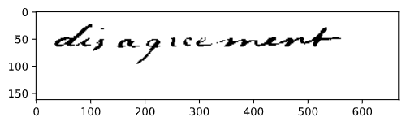
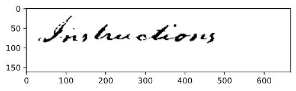

# 3_Keyword_Spotting
Pattern Recognition Task 3
## Results
### Result of preprocessing

Once the whole process is done the data left looks like this:

### Features

### DTW algorithm and evaluation
For the DTW algorithm, the implementation used is the one proposed [by the library tslearn](https://tslearn.readthedocs.io/en/stable/gen_modules/metrics/tslearn.metrics.dtw.html#tslearn.metrics.dtw).

After sorting the results and filtering the words to only those that appears both in training and validation set, the precision and recall was computed for each threshold k.

Here are some examples of good results :
* AP = 0.826, word : Instructions

 
  
* AP = 1.0, word : John

 

However the majority of words resulted in less good results, maybe because of their number of occurences or difference in each page, therefore the final curve of precision and recall is the following :

